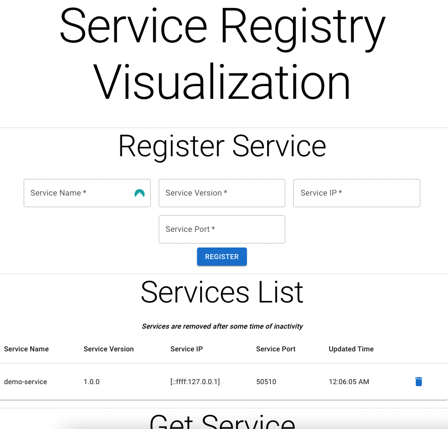
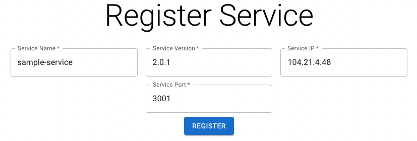
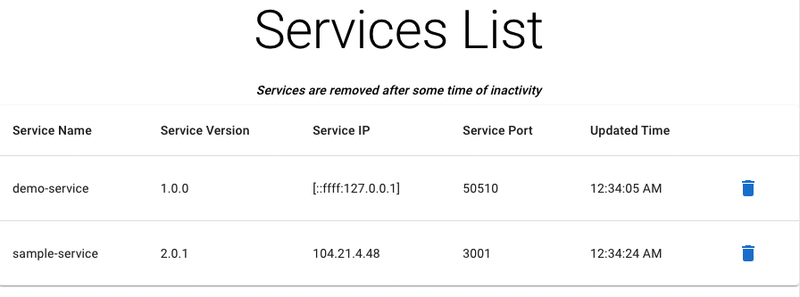
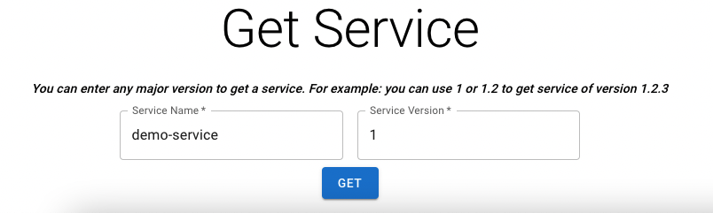

# Service Registry visualisation

## Run
### Dev
You need to set up environment variables as described in 'Configuration' sections [in the docs below](#docs) before running these commands.

1. `cd ./service-registry && npm i && npm run start`
2. `cd ./cacher && npm i && npm run start`
3. `cd ./demo-service && npm i && npm run start`
4. `cd ./web-portal && npm i && npm run start`

## Docs
### Web app
Web app contains information about currently running services:



#### Registering a service
You can register a service using **'Register Service'** form:



#### List running services
You can view list of running services using **'Services List'** table:



#### View single service info
You can grab info about specific service using **'Get Service'** form:



**'Service Version'** input there can contain any [semantic version](https://semver.org/) value (for example, for a `2.0.4` version we can simply put `2` into the textbox).

### API
#### Service Registry
Service Registry is placed under [./service-registry](./service-registry) folder.

Endpoints map to [the forms showed in the web app](#web-app):
- `PUT /register/:serviceName/:serviceVersion/:servicePort/:serviceIp?`
- `DELETE /unregister/:serviceName/:serviceVersion/:servicePort/:serviceIp?`
- `GET /find/all`
- `GET /find/:serviceName/:serviceVersion`

Services are cleaned up after 30 seconds being not registered again.

##### Configuration
You need to set `NODE_ENV` and `PORT` env variables. For example:
```
NODE_ENV=development
PORT=3000
```

#### Cacher
Cacher is used for caching endpoints in case Service Registry is unavailable. You may send requests directly to Cacher port (using [Service Registry API](#service-registry)), it will handle requests to the Service Registry by itself.

Cacher is placed under [./cacher](./cacher) folder.

##### Configuration
You need to set `NODE_ENV`, `PORT` and `SERVICE_REGISTRY_URL` env variables. For example:
```
NODE_ENV=development
PORT=3003
SERVICE_REGISTRY_URL=http://localhost:3000
```

#### Demo Service
It's just used for demonstration purposes. It makes request to the Service Registry to register/unregister itself.

Demo Service is placed under [./demo-service](./demo-service) folder.

##### Configuration
You need to set `NODE_ENV` and `SERVICE_REGISTRY_HOST` env variables. For example:
```
NODE_ENV=development
SERVICE_REGISTRY_HOST=http://localhost:3000
```

#### Wep App
Contains API visualisation. Makes requests to the Cacher to register/get/unregister services.

Wep App is placed under [./web-portal](./web-portal) folder.

##### Configuration
You need to set `REACT_APP_API_HOST` env variable. For example:
```
REACT_APP_API_HOST=http://localhost:3003/
```